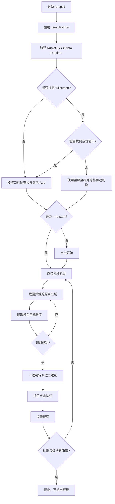
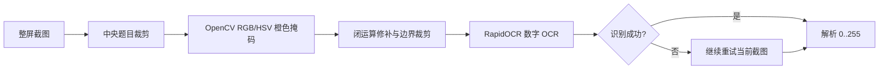

# 二进制速算自动化技术文档

## 1. 目标

自动完成 Turing Complete 的“二进制速算”关卡：

1. 进入准备界面后点击“开始”。
2. 读取题目给出的十进制数字。
3. 将数字转换为 8 位二进制。
4. 点击对应的 128、64、32、16、8、4、2、1 按钮。
5. 点击“提交”。
6. 检测到等级结果弹窗后停止，不点击“继续”。

## 2. 代码结构

实现位于 `automation/binary_speed/` Python 包中，各模块职责明确：

- `runner.py`：命令行参数和流程编排。
- `game.py`：截图、超时检测、点击和二进制答案输入。
- `ocr.py`：RapidOCR 题目识别和游戏状态文本 OCR。
- `vision.py`：题目区域的 OpenCV 预处理。
- `window.py`：游戏窗口查找与屏幕区域选择。
- `diagnostics.py`：可选截图和事件记录，只消费已捕获帧，不控制游戏。
- `models.py`：公共坐标和 OCR 结果模型。
- `__main__.py`：提供 `python -m binary_speed` 入口。

PowerShell 启动脚本使用项目 `.venv` 执行该包，不再保留重复的单文件实现或兼容入口。

## 3. 总体流程



## 4. 窗口与坐标

脚本优先使用 `pygetwindow`：

- 默认匹配窗口标题中的 `Turing Complete` 或 `二进制速算`。
- 找到后调用 `activate()` 将 App 切到前台。
- 读取窗口位置和尺寸，将按钮坐标保存为相对比例。

当窗口标题不可读时，`--fullscreen` 使用整块屏幕作为坐标区域，并通过 `--wait-seconds` 给用户时间点击任务栏图标。该模式不能凭空知道哪个任务栏图标是游戏，因此不能保证完全自动切换。

主要比例坐标来自提供的 2559×1440 布局：

| 控件 | 相对位置 |
| --- | --- |
| 开始 | `(0.500, 0.420)` |
| 8 个位按钮 | `x = 0.274 ... 0.684`, `y = 0.835` |
| 提交 | `(0.500, 0.950)` |

## 5. OCR 识别

题目数字使用橙色字体，脚本不会直接对整屏 OCR，而是：

1. 截取屏幕中央的题目区域。
2. 使用 OpenCV 按 RGB/HSV 条件保留橙色像素。
3. 用形态学闭运算修补数字笔画，并用橙色像素比例筛选题目候选框。
4. 将中央题目区域交给 RapidOCR ONNX 模型识别数字。
5. 使用 RapidOCR 识别题目数字，并从整屏 RapidOCR 文本中判断游戏状态。

这样可以排除顶部的“第 1 级”、白色倒计时和底部按钮文字。识别结果仍可能受 DPI 缩放、窗口裁剪或游戏动画影响，因此脚本会重复尝试最多 20 次。



## 6. 二进制换算与点击

按钮权重按从左到右排列：

```text
128 64 32 16 8 4 2 1
```

对每个权重执行按位与：

```python
if number & weight:
    click(button)
```

例如 `13`：

```text
13 = 8 + 4 + 1 = 00001101
```

因此点击 `8`、`4`、`1`，最后点击“提交”。转换本身是确定性的；若游戏判错，优先排查 OCR 结果、按钮坐标或按钮状态重置，而不是二进制转换逻辑。

## 7. 停止条件

提交后脚本 OCR 整个画面，检测包含“达到”“成绩”“漂亮”或“恭喜”的等级文本，并提取 `第 N 级`。识别到后立即停止，不点击结果弹窗里的“继续”。超时页面出现“时间到”时也立即停止。

## 8. 当前已知限制

- 全屏模式无法从任务栏图标本身可靠推断目标窗口；如果窗口标题不可读，需要手动切换一次。
- 题目数字和状态文本识别依赖 RapidOCR ONNX Runtime。
- 坐标使用相对比例，但游戏 UI 布局变化仍可能影响点击。
- 实时诊断模式会记录每一题的原始截图、RapidOCR 输入图、OCR 文本和点击结果。

## 9. 后续排查方向

发生“游戏显示计算错误”时，应按以下顺序检查：

1. 打印该题 OCR 原文和解析出的十进制数字。
2. 保存该题橙色数字掩码图，确认 OCR 输入是否正确。
3. 记录实际点击的按钮权重。
4. 截图验证按钮是否已经变绿，以及点击后是否被动画或窗口切换干扰。
5. 确认新题目出现后按钮状态已重置。
